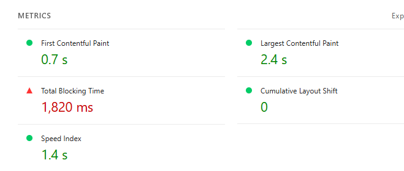
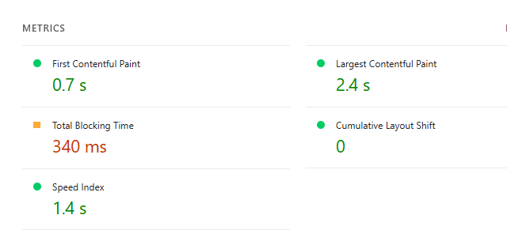

# Enhanced FE Prompt Engineering

## Task 1

## Goal

1.  Recreate the UI as a single React function component (PricingCard.tsx) using - TypeScript and TailwindCSS.
2.  Props must be:
    -plan: string
    -price: string
    -features: string[]
    -isFeatured?: boolean
3.  Behaviour: stack vertically < 640 px, hover elevation on desktop, full keyboard focus ring.
4.  No inline styles; use Tailwind only.
5.  Get just the TSX inside tsx fences.

**Result**

```
        <div
          tabIndex={0}
          className={`
            flex flex-col items-center
            rounded-md
            px-8 py-8
            w-full sm:w-80
            outline-none
            transition
            duration-200
            border
            ${isFeatured
              ? "bg-[#3c4a5a] text-white border-transparent shadow-xl scale-105 z-10"
              : "bg-white text-[#3c4a5a] border-gray-200 shadow"
            }
            hover:shadow-[0_10px_40px_10px_rgba(60,74,90,0.25)]
            focus:ring-4 focus:ring-blue-300
          `}
          aria-label={`${plan} plan`}
        >
          <div className="text-base font-bold mb-2 tracking-wide">{plan}</div>
          <div className="text-5xl font-bold mb-2">${price}</div>
          <div className="h-1 w-12 mb-4" />
          <ul className="w-full mb-6">
            {features.map((feature, idx) => (
              <li
                key={idx}
                className={`
                  text-center py-2 border-t border-gray-200
                  ${isFeatured ? "border-blue-200 font-semibold" : ""}
                  ${idx === features.length - 1 ? "border-b" : ""}
                  ${isFeatured ? "border-opacity-30" : ""}
                `}
              >
                {feature}
              </li>
            ))}
          </ul>
          <button
            className={`
              mt-4
              w-full
              py-2
              rounded
              font-bold
              tracking-wide
              transition
              duration-150
              focus:outline-none
              focus:ring-2 focus:ring-blue-400
              ${
                isFeatured
                  ? "bg-[#3c4a5a] text-white border border-white hover:bg-[#2e3a47]"
                  : "bg-white text-[#3c4a5a] border border-[#3c4a5a] hover:bg-gray-100"
              }
            `}
          >
            SUBSCRIBE
          </button>
        </div>
```

## Task 2

## Goal

At exactly 768 px the menu “ghosts” in and out.

1. Use ChatGPT/ Cursor to identify the root cause of the slide-down glitch.
2. Produce a patched styles.css (CSS fence, nothing extra) that fixes it.

**Result**

```
/* styles.css */
.nav {
  display: flex;
  justify-content: space-between;
  align-items: center;
}

.menu {
  display: flex;
  gap: 2rem;
}

/* Patch for menu slide-down glitch at 768px breakpoint */
@media (max-width: 767.98px) {
  .menu {
    transition: max-height 0.3s cubic-bezier(0.4, 0, 0.2, 1),
      opacity 0.3s cubic-bezier(0.4, 0, 0.2, 1);
    overflow: hidden;
    max-height: 0;
    opacity: 0;
    pointer-events: none;
  }
  .menu.open {
    max-height: 1000px; /* large enough for menu content */
    opacity: 1;
    pointer-events: auto;
  }
}

@media (min-width: 768px) {
  .menu {
    transition: none;
    max-height: none;
    opacity: 1;
    overflow: visible;
    pointer-events: auto;
  }
  .menu.open {
    max-height: none;
    opacity: 1;
    pointer-events: auto;
  }
}

```

## Task 3

## Goal

Goal

1. Ask the model why Total Blocking Time is high.
2. Rewrite Dashboard.tsx so the heavy loop runs in a Web Worker (no UI jank).
3. Provide a metric checklist to re-measure.
4. Stretch: auto-generate a commit message + PR description summarising the fix.

**Result**

1. Unswer:
   You're seeing a high Total Blocking Time (TBT) because of this line in your useEffect:

```
for (let i = 0; i < 1e8; i++) { t += i; }
```

This runs on the main thread, immediately after the component mounts, and:

- Blocks the browser from handling user input, rendering, animations, etc.
- Delays the "Time to Interactive" (TTI), which contributes directly to high TBT.

2. Code:

```
import React, { useEffect, useState } from "react"

export default function Dashboard() {
const [d, setD] = useState<number | null>(null)

useEffect(() => {
const workerCode = `  self.onmessage = function () {
        let t = 0;
        for (let i = 0; i < 1e8; i++) {
          t += i;
        }
        self.postMessage(t);
      };`

    const blob = new Blob([workerCode], { type: "application/javascript" })
    const worker = new Worker(URL.createObjectURL(blob))

    worker.onmessage = (e) => {
      setD(e.data)
      worker.terminate()
    }

    worker.postMessage("start")

    return () => {
      worker.terminate()
    }

}, [])

return <div>{d !== null ? d : "Вычисление..."}</div>
}
```

3. Checklists:




